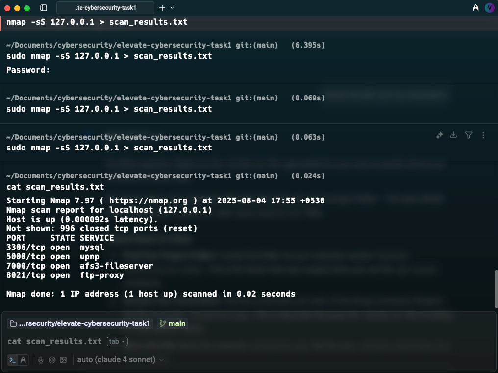

# elevate-cybersecurity-task1
# Task 1: Local Network Port Scan

## Objective
[cite_start]The objective of this task was to learn how to discover open ports on devices in the local network to understand network exposure[cite: 6]. [cite_start]This involves using network scanning tools to perform reconnaissance and identify potential security risks[cite: 13, 16].

## Tools Used
* [cite_start]**Nmap:** Used for performing the port scan[cite: 7].

## Process
1.  [cite_start]**Network Identification:** First, I identified my local network range to define the scan target[cite: 10].
2.  [cite_start]**Scan Execution:** I executed a TCP SYN scan (`-sS`) as specified in the task instructions[cite: 11]. This scan type required root privileges (`sudo`) because it creates raw network packets to check for open ports without completing a full TCP connection.
3.  [cite_start]**Output Redirection:** The command was run as `sudo nmap -sS 127.0.0.1 > scan_results.txt` to save the output directly to a file for analysis[cite: 14].
4.  [cite_start]**Analysis:** Finally, I analyzed the saved results to identify listening services and evaluate potential security vulnerabilities[cite: 13].

## Scan Results & Analysis
[cite_start]The scan was performed on `localhost` (127.0.0.1) and revealed the following four open TCP ports[cite: 48]:

| Port       | State | Service         | Analysis                                                                                           |
| :--------- | :---- | :-------------- | :------------------------------------------------------------------------------------------------- |
| `3306/tcp` | open  | `mysql`         | [cite_start]This port is the default for the MySQL database service, indicating a database server is running[cite: 49]. |
| `5000/tcp` | open  | `upnp`          | [cite_start]This port is commonly used for Universal Plug and Play, which allows for automatic device discovery[cite: 49]. |
| `7000/tcp` | open  | `afs3-fileserver` | [cite_start]This port is associated with the Andrew File System, suggesting a distributed file service may be active[cite: 49].|
| `8021/tcp` | open  | `ftp-proxy`     | [cite_start]This port is commonly used for an FTP (File Transfer Protocol) proxy service[cite: 49].                 |

*Screenshot of the scan being executed:*

## Identified Security Risks
[cite_start]Based on the open ports found, the following potential security risks were identified[cite: 13, 20]:

* **MySQL (Port 3306):** An exposed database server is a high-value target. Risks include brute-force attacks on weak credentials, SQL injection vulnerabilities, and potential data theft if not properly firewalled and secured.
* **UPnP (Port 5000):** UPnP has known historical vulnerabilities that could allow an attacker on the local network to manipulate network configurations or pivot to other devices.
* **AFS File Server (Port 7000):** Any file server, if misconfigured, can lead to unauthorized file access, modification, or data leakage.
* **FTP Proxy (Port 8021):** FTP is an insecure protocol that transmits credentials in plaintext. An FTP proxy could be exploited or abused if not securely configured, posing a risk of credential theft.

## Key Learnings
[cite_start]This task provided practical experience in network reconnaissance[cite: 16, 26]. [cite_start]The key takeaway is that open ports are potential entry points for attackers, and it is crucial to understand what services are running on a network and to ensure they are properly secured, for example, by using a firewall to close unnecessary ports[cite: 22, 23].
